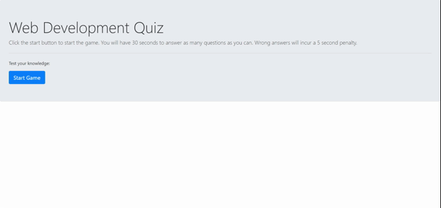

# 04 Web APIs: Code Quiz

## Overview of the Application

This application uses arrays, and local storage to deliver a series of questions.  The player can select from the multiple choice options to answer each question.  If the player guesses correctly, the question advances, if they guess incorrectly, they lose 5 seconds on their timer.

At the end of the quiz, the player can input their initials to save their score in local storage.  The player can then use the retry button to take the quiz again and try to beat their high score.



## Acceptance Criteria

```
GIVEN I am taking a code quiz
WHEN I click the start button
THEN a timer starts and I am presented with a question
WHEN I answer a question
THEN I am presented with another question
WHEN I answer a question incorrectly
THEN time is subtracted from the clock
WHEN all questions are answered or the timer reaches 0
THEN the game is over
WHEN the game is over
THEN I can save my initials and my score
```


## Grading Requirements


* [x] Satisfies all of the preceding acceptance criteria.

### Deployment: 32%

* [x] Application deployed at live URL.

* [x] Application loads with no errors.

* [x] Application GitHub URL submitted.

* [x] GitHub repository contains application code.

### Application Quality: 15%

* [x] Application user experience is intuitive and easy to navigate.

* [x] Application user interface style is clean and polished.

* [x] Application resembles the mock-up functionality provided in the homework instructions.

### Repository Quality: 13%

* [x] Repository has a unique name.

* [x] Repository follows best practices for file structure and naming conventions.

* [x] Repository follows best practices for class/id naming conventions, indentation, quality comments, etc.

* [x] Repository contains multiple descriptive commit messages.

* [x] Repository contains quality readme file with description, screenshot, and link to deployed application.

### Code Overview:

To display the questions on the quiz, each question is stored as an object in the Script.js file.  The startGame function takes the first question and displays it into the hidden <div> and starts the timer:

```
var myQuestions=[
    {
        question: "What is Javascript?",
        answers:
        {
            a: "a programming language.",
            b: "a planet",
            c: "a new car",
            d: "a screenplay about a cup of coffee trying to find it's way home"
        },
        correctAnswer: "a"
    }
```
```
// Starts the game
function startGame(event){
    timerCountdown();
    startGameEl.hide();
};

startGameEl.on("click", startGame);
```

The quiz ends when the timer is below zero or the player answers all questions.

```
 if(questionNumber===myQuestions.length-1){
        clearInterval(timer);
        gameOverEl.modal("show");
        return;
    }

    if (currentTime<=0){
            clearInterval(timer);
            gameOverEl.modal("show");
        }
```

